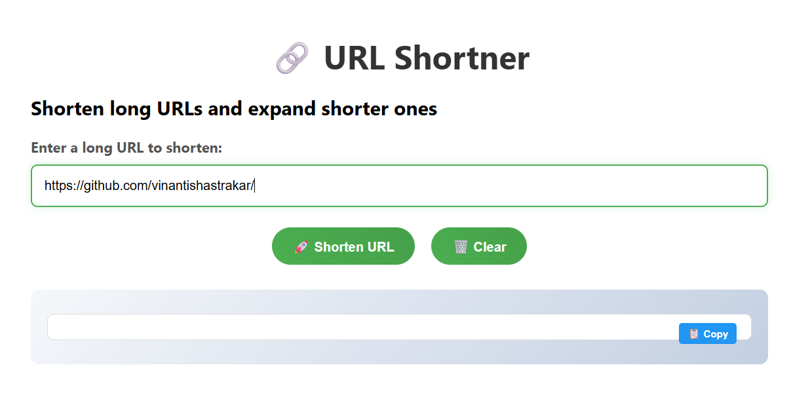

# URL Shortener

A Django REST API for shortening long URLs with automatically generated random short codes. This project allows users to submit long URLs and receive shortened versions that redirect to the original URLs.



## Features

- 🔗 Convert long URLs to short, shareable links
- 🎲 Automatically generate 10-character random short codes
- 💾 Store URL mappings in database with DataUrl model
- 🔄 Redirect short URLs to original destinations
- 📊 Full CRUD operations on URL records
- 🛡️ URL validation and error handling
- 🌐 Web interface for easy URL shortening

## Technology Stack

- **Backend**: Django + Django REST Framework
- **Database**: SQLite (default) / PostgreSQL / MySQL
- **API**: RESTful API using APIView
- **Frontend**: HTML templates for web interface
- **Python**: 3.13+

## Installation

### Prerequisites

- Python 3.13 or higher
- uv (Python package manager)

Note : Make sure you have installed uv, if not run the command `pip install uv`.

### Setup

1. **Clone the repository**
```bash
git clone https://github.com/vinantishastrakar/URL-Shortner.git
cd URL-Shortner
```

2. **Installation**
```bash
uv sync
```

3. **Configure Database**
```bash
uv run python manage.py makemigrations
uv run python manage.py migrate
```

4. **Create superuser (optional)**
```bash
uv run python manage.py createsuperuser
```

5. **Run the development server**
```bash
uv run python manage.py runserver
```

The API will be available at `http://localhost:8000/`

## API Endpoints

### Shorten URL

**POST** `/api/`

Create a short URL from a long URL.

**Request Body:**
```json
{
    "longurl": "https://www.example.com/very/long/url/path"
}
```

**Response:**
```json
{
    "shorturl": "http://localhost:8000/abc123",
    "longurl": "https://www.example.com/very/long/url/path",
}
```

### Redirect Short URL

**GET** `/{shorturl}/`

Redirects to the original long URL.

**Example:**
```
GET /abc123/ → Redirects to https://www.example.com/very/long/url/path
```

## Usage Examples

### Using CURL

```bash
# Shorten a URL
curl -X POST http://localhost:8000/urls/ \
  -H "Content-Type: application/json" \
  -d '{"longurl": "https://www.google.com"}'

# Access shortened URL
curl -L http://localhost:8000/abc123/
```

### Using Python requests

```python
import requests

# Shorten URL
response = requests.post(
    'http://localhost:8000/urls/',
    json={'longurl': 'https://www.google.com'}
)
data = response.json()
print(f"Short URL: {data['shorturl']}")

# Access the short URL
redirect_response = requests.get(data['shorturl'], allow_redirects=False)
print(f"Redirects to: {redirect_response.headers['Location']}")
```

## Project Structure

```
url-shortener/
│   .gitignore
│   .python-version
│   db.sqlite3
│   main.py
│   manage.py
│   pyproject.toml
│   README.md
│   uv.lock
│
├───urlApp
│   │   admin.py
│   │   apps.py
│   │   models.py
│   │   serializers.py
│   │   tests.py
│   │   urls.py
│   │   views.py
│   │   __init__.py
│   │
│   ├───migrations
│   │       0001_initial.py
│   │       0002_alter_dataurl_shorturl.py
│   │       __init__.py
│   │
│   ├───static
│   │   └───urlApp
│   │           index.css
│   │
│   └───templates
│       └───urlApp
│               index.html
│
└───urlShortner
        asgi.py
        settings.py
        urls.py
        wsgi.py
        __init__.py
```

## Database Schema

### URL Model

| Field | Type | Description |
|-------|------|-------------|
| id | AutoField | Primary key |
| longurl | URLField | Original long URL |


## Error Handling

The API returns appropriate HTTP status codes:

- `200 OK` - Successful URL shortening
- `400 Bad Request` - Invalid URL format
- `404 Not Found` - Short code not found

## Contributing

1. Fork the repository
2. Create a feature branch (`git checkout -b feature/amazing-feature`)
3. Commit your changes (`git commit -m 'Add amazing feature'`)
4. Push to the branch (`git push origin feature/amazing-feature`)
5. Open a Pull Request

## Acknowledgments

- Django REST Framework documentation
- Python community for excellent libraries
- Contributors and testers
